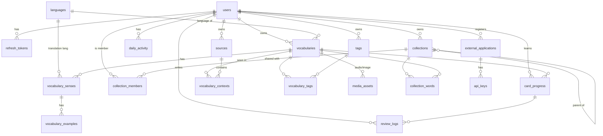

# Voca — Thiết kế hệ thống (v0.2, đã duyệt và triển khai MVP)

> Stack đã chốt: **Python Flask** (monolith theo module) · **SQLite** khi chạy local · **Turso (libSQL)** trên production · triển khai **Vercel** (serverless) · chạy Python trực tiếp, không cần Docker.
>
> Quyết định đã chốt (2026-09-28): Turso qua Vercel · Jinja + HTMX · mỗi người giữ bản từ của riêng mình · giao diện tiếng Việt · không dùng Docker.
> Ngày: 2026-09-28

---

## 1. Phân tích sản phẩm

### 1.1 Giá trị cốt lõi

```
Thu thập từ (kèm ngữ cảnh)  →  Review Engine (SRS)  →  Thói quen hằng ngày  →  Ghi nhớ lâu dài
```

CRUD từ vựng chỉ là đầu vào. Sản phẩm thắng hay thua ở ba chỗ:

1. **Thêm từ gần như không tốn công**: lưu ngay lúc gặp từ (caption app, extension, hỏi ChatGPT). Ghi chú trong `feature_notes.txt` đã nói đúng điều này.
2. **Lịch ôn đáng tin**: mỗi ngày mở app là biết ngay hôm nay cần ôn gì, bao nhiêu từ, trong khoảng bao lâu.
3. **Ngữ cảnh**: từ gắn với câu và tài liệu nơi bạn gặp nó. Đây là điểm khác biệt so với 4English.

Vì vậy **Learning Engine là core domain**. Nó là code Python thuần, không phụ thuộc Flask hay DB, và có unit test đầy đủ.

### 1.2 Đề xuất cải tiến so với spec gốc

| # | Vấn đề trong spec | Đề xuất |
|---|---|---|
| 1 | `ReviewSchedule` và `UserVocabularyProgress` trùng nhau | Gộp thành **`card_progress`**, trạng thái SRS của một cặp (user, từ). `review_logs` là log chỉ ghi thêm (append-only). |
| 2 | Word chỉ có một nghĩa | Một từ có nhiều **sense** (leverage: noun "đòn bẩy" / verb "tận dụng"). Mỗi sense có loại từ, định nghĩa, bản dịch và ví dụ riêng. |
| 3 | Chưa có ngữ cảnh | Thêm **`sources`** (sách, bài báo, video, caption) và **`vocabulary_contexts`** (câu gốc, vị trí, URL). Ghi chú của bạn về "Context vocabulary" được đưa vào ngay từ MVP (ở mức schema và UI đơn giản). |
| 4 | Mỗi mode học chấm điểm khác nhau | Mọi mode đều quy về **4 mức Again / Hard / Good / Easy**, nên engine chỉ có một đầu vào. Xem §5.3. |
| 5 | SM-2 bị hardcode | Đặt sau interface `Scheduler`. `review_logs` lưu đủ dữ liệu để sau này chuyển sang **FSRS** (chính xác hơn SM-2) mà không mất lịch sử. |
| 6 | Không nói gì về múi giờ | "Hôm nay", streak và heatmap đều tính theo **timezone của user** (mặc định `Asia/Ho_Chi_Minh`). DB lưu UTC. |
| 7 | Thêm từ từ nguồn ngoài dễ bị trùng | Chuẩn hoá từ (`normalized_text`) và đặt unique theo (owner, ngôn ngữ, từ). API external dùng **upsert**: từ đã có thì chỉ gắn thêm context mới. |
| 8 | Chưa có nút "đã biết từ này" | Cho phép **Mark as known** (vào MASTERED luôn) và **Suspend** (tạm ngưng ôn), giống 4English. |
| 9 | Thống kê phải quét toàn bộ log | Thêm bảng tổng hợp **`daily_activity`** (một dòng cho mỗi user mỗi ngày) để dashboard, streak và heatmap truy vấn O(ngày). |
| 10 | Từ lưu từ nguồn ngoài không có chỗ chứa | Mỗi user có collection hệ thống **"Inbox"**. Từ từ extension/caption app vào đây, user xem lại rồi phân loại. |
| 11 | Hỏi ChatGPT → tự lưu định nghĩa (feature_notes) | Định nghĩa port `EnrichmentProvider` (LLM hoặc từ điển) ngay từ đầu, implement ở phase sau. External API nhận payload thiếu nghĩa, đánh dấu `needs_enrichment`. |

### 1.3 Ràng buộc khi deploy Vercel (ảnh hưởng tới thiết kế)

| Ràng buộc | Cách xử lý |
|---|---|
| Serverless, stateless, không ghi được filesystem (trừ `/tmp`) | Không dùng file SQLite trên prod; dùng **Turso** (libSQL qua HTTP). Media đi qua `StorageBackend` (Vercel Blob hoặc S3). Session lưu trong JWT cookie. |
| Mỗi lần gọi có thể mở connection DB mới | Turso dùng giao thức HTTP (Hrana), mở kết nối rẻ. SQLAlchemy dùng `NullPool` vì stream Hrana hết hạn khi rảnh. |
| Không có background worker | MVP không cần. Việc định kỳ dùng **Vercel Cron** gọi endpoint nội bộ (có secret). Streak tính lúc đọc. |
| Cold start, giới hạn kích thước bundle | Ít dependency, không kéo thư viện ML. AI gọi qua HTTP API. |
| Không chạy migration lúc khởi động | `flask db upgrade` chạy từ CI hoặc máy local với `DATABASE_URL` của prod. |
| Rate limit cần store dùng chung | MVP: Flask-Limiter `memory://` (đếm riêng theo từng instance). Cần chặt hơn thì trỏ `RATELIMIT_STORAGE_URI` sang Redis (Upstash). |

---

## 2. Kiến trúc

### 2.1 Tổng quan

```
             Browser (Jinja + HTMX)   Mobile app (sau)   Extension / Caption app / ChatGPT tool
                      │                     │                          │
                      │ cookie JWT          │ Bearer JWT               │ X-API-Key
                      ▼                     ▼                          ▼
        ┌──────────────────────────────────────────────────────────────────────┐
        │                        Flask app (1 deployable)                      │
        │  web/ (trang HTML)          api/v1 (REST JSON)     api/v1/external   │
        │ ──────────────────────────────────────────────────────────────────── │
        │  Modules:  auth · vocabulary · collections(+sharing) · learning      │
        │            · stats · external                                        │
        │  mỗi module:  routes → service (use case) → models (SQLAlchemy)      │
        │ ──────────────────────────────────────────────────────────────────── │
        │  core: config · errors · logging · security · pagination · clock     │
        │  ports: StorageBackend · EnrichmentProvider · Scheduler(SRS)         │
        └──────────────────────────────────────────────────────────────────────┘
                      │                                   │
          SQLite (local) / Turso (prod)           Object storage (sau)
```

**Monolith có module**, chưa tách microservice. Quy tắc để sau này tách dễ:
- Module chỉ gọi **service** của module khác, không đọc thẳng model hay bảng của module khác.
- `learning/engine/` là Python thuần (dataclass vào, dataclass ra), không import Flask hay SQLAlchemy.
- HTTP layer mỏng: validate (Pydantic), gọi service, serialize.
- Service dùng SQLAlchemy trực tiếp; các truy vấn phân quyền và truy vấn dùng chung nằm ở `collections/access.py` (chưa tách repository riêng vì chưa cần).
- Tầng web dùng lại đúng các service này; các thao tác ghi đi qua REST API bằng `static/js/api.js`.

### 2.2 Chọn công nghệ

| Hạng mục | Chọn | Lý do |
|---|---|---|
| Web framework | **Flask 3** (app factory + blueprints) | Theo yêu cầu. Vercel chạy WSGI Flask sẵn. Nhẹ nên cold start nhanh. |
| ORM + migration | **SQLAlchemy 2.0** + **Flask-Migrate (Alembic)** | Chuẩn của hệ Python. Typed `Mapped[]`. Migration có version. |
| DB | **SQLite** (local, file `instance/voca.db`) · **Turso/libSQL** (prod) | Cùng một dialect SQLite nên local và prod chạy cùng SQL. Kiểu `JSON` cho thuộc tính riêng của từng ngôn ngữ và cho danh sách từ đồng nghĩa. Driver `libsql` có bản build sẵn cho Windows và Linux; `app/core/libsql_dbapi.py` bọc nó theo chuẩn PEP 249, và `app/core/libsql_dialect.py` đăng ký dialect `sqlite+libsql`. |
| Validation | **Pydantic v2** | Schema request/response rõ ràng, dùng lại được cho docs OpenAPI. |
| Auth | **Flask-JWT-Extended** | Access token 15 phút + refresh token 30 ngày có **rotation** và revoke. Web dùng httpOnly cookie + CSRF double-submit. API/mobile dùng header Bearer. |
| Password | `werkzeug.security` (scrypt) | Không thêm dependency, an toàn. Có thể nâng lên argon2 sau. |
| API key | Chuỗi random `voca_<prefix>_<secret>`, DB chỉ lưu **SHA-256** | Chỉ hiện đúng một lần lúc tạo. Có scope và revoke. |
| Frontend | **Jinja2 + HTMX + Alpine.js** (qua CDN), CSS tự viết (mobile-first) | Deploy một lần, không cần Node build trên Vercel. Mobile app sau này dùng `/api/v1`. |
| Rate limit | **Flask-Limiter** | Áp cho auth và external. Storage cấu hình được. |
| Logging | `logging` với JSON formatter, request-id | Vercel thu log từ stdout. |
| Test | **pytest** | SRS engine test thuần; service và API test với SQLite in-memory; một test chạy qua driver libSQL. |
| Chạy local | `python run.py` trong venv | Không cần Docker hay DB server. |

> Vì sao không dùng NestJS/Next.js như spec gốc: bạn đã chọn Flask. Điểm yếu của Flask là không có sẵn DI hay cấu trúc, nên cấu trúc module ở §2.3 được áp đặt và giữ kỷ luật bằng quy ước và test.

### 2.3 Cấu trúc thư mục

```
voca/
├── api/index.py                  # Entry cho Vercel: app = create_app()
├── vercel.json
├── requirements.txt / pyproject.toml
├── run.py · .env.example
├── migrations/                   # Alembic
├── app/
│   ├── __init__.py               # create_app()
│   ├── config.py                 # Dev/Test/Prod, đọc từ env
│   ├── extensions.py             # db, migrate, jwt, limiter
│   ├── core/                     # errors, logging, security, pagination, clock, text_normalize
│   ├── ports/                    # storage.py, enrichment.py (interface + impl)
│   ├── modules/
│   │   ├── auth/                 # models, repository, service, schemas, routes
│   │   ├── vocabulary/
│   │   ├── collections/          # gồm sharing
│   │   ├── learning/
│   │   │   ├── engine/           # sm2.py, grading.py, types.py (THUẦN PYTHON)
│   │   │   ├── quiz/             # tạo câu hỏi MCQ, typing
│   │   │   └── service.py, routes.py ...
│   │   ├── stats/
│   │   └── external/             # api keys, applications, capture endpoint
│   └── web/                      # route HTML + templates/ + static/
└── tests/
    ├── unit/                     # engine, grading, normalize
    └── integration/              # service + API
```

---

## 3. Database

### 3.1 ERD



### 3.2 Các bảng

Chung cho mọi bảng: `id` là UUID dạng chuỗi, `created_at`, `updated_at`. SQLite không có timestamptz nên cột lưu UTC dạng naive; kiểu `UTCDateTime` trả về datetime có timezone UTC.

**Người dùng và xác thực**

| Bảng | Cột chính | Ghi chú |
|---|---|---|
| `users` | email (unique, luôn lưu chữ thường), password_hash, display_name, native_language_code (`vi`), timezone (`Asia/Ho_Chi_Minh`), daily_new_limit (10), daily_review_limit (100), daily_goal (20), is_active, last_login_at | Cài đặt học nằm trên user, sau này tách ra `user_settings` nếu cần |
| `refresh_tokens` | user_id, jti (unique), family_id, expires_at, revoked_at, replaced_by, user_agent, ip | Rotation: token cũ bị dùng lại thì revoke cả family (phát hiện token bị đánh cắp) |

**Ngôn ngữ và từ vựng** (không có trường nào gắn riêng với tiếng Anh)

| Bảng | Cột chính | Ghi chú |
|---|---|---|
| `languages` | code (PK, ISO 639-1: `en`, `vi`, `ja`, `ko`, `fr`), name, native_name, script, is_rtl | Seed sẵn |
| `vocabularies` | owner_id, language_code, text, normalized_text, phonetic, attributes (JSON), difficulty (CEFR `A1..C2` hoặc null), notes, source_type (`manual`/`external`/`import`), enrichment_status | `attributes` (JSON) chứa phần riêng của từng ngôn ngữ: `{"reading":"たべる"}` (ja), `{"gender":"f"}` (fr), `{"romanization":"..."}` (ko). **UNIQUE(owner_id, language_code, normalized_text)** |
| `vocabulary_senses` | vocabulary_id, position, part_of_speech, definition (cùng ngôn ngữ với từ), translation, translation_language_code, synonyms (JSON), antonyms (JSON) | Chính là "VocabularyMeaning" trong spec. Có nhiều sense cho mỗi từ |
| `vocabulary_examples` | sense_id, sentence, translation, position | |
| `sources` | owner_id, type (`book`/`article`/`video`/`caption`/`chat`/`course`/`other`), title, url, author, meta (JSON) | "Quant book", "IELTS Cambridge 18" |
| `vocabulary_contexts` | vocabulary_id, source_id (nullable), sentence, location (chương/trang/timestamp), url, captured_via (app name), captured_at | **Context vocabulary**. Một từ có thể có nhiều ngữ cảnh |
| `tags` | owner_id, name, UNIQUE(owner_id, name) | |
| `vocabulary_tags` | vocabulary_id, tag_id (PK kép) | |
| `media_assets` | vocabulary_id, kind (`audio`/`image`), storage_key, mime, provider, meta | Dành cho Listening mode sau này |

**Collection và chia sẻ**

| Bảng | Cột chính | Ghi chú |
|---|---|---|
| `collections` | owner_id, parent_id (self FK), name, description, visibility (`private`/`shared`/`public`), system_key (`inbox`), share_token (link mời), language_code | Có thể lồng nhau (IELTS → Academic words) |
| `collection_words` | collection_id, vocabulary_id, added_by, position, added_at (PK kép) | N–N: một từ có thể nằm trong nhiều collection |
| `collection_members` | collection_id, user_id, role (`viewer`/`editor`), joined_at, UNIQUE(collection_id, user_id) | Chính là "SharePermission". Owner lấy từ `collections.owner_id` |
| `study_plans` | user_id, collection_id, status (`active`/`paused`), new_per_day, started_at, paused_at, UNIQUE(user_id, collection_id) | Kế hoạch học một bộ từ; chỉ từ thuộc bộ có kế hoạch `active` mới được lên lịch |

Quy tắc phân quyền:
- `private`: chỉ owner xem được.
- `shared`: owner và các member.
- `public`: ai cũng xem được. Muốn học thì phải "Join" (tạo member với role `viewer`).
- `editor` được thêm/sửa/xoá từ trong collection. `viewer` chỉ xem và học.
- Từ vẫn thuộc sở hữu của người tạo. Người học có **progress riêng**. Có thể "Clone" collection thành bản sao của mình (phase 2).

**Học tập (core domain)**

| Bảng | Cột chính | Ghi chú |
|---|---|---|
| `card_progress` | user_id, vocabulary_id, status (`NEW`/`LEARNING`/`REVIEWING`/`MASTERED`/`SUSPENDED`), due_at, interval_days, ease_factor (2.5), repetitions, lapses, review_count, correct_count, wrong_count, first_reviewed_at, last_reviewed_at, UNIQUE(user_id, vocabulary_id) | Gộp ReviewSchedule và UserVocabularyProgress. Chỉ tạo khi từ được **đưa vào học lần đầu** (lazy) |
| `review_logs` | user_id, card_progress_id, vocabulary_id, mode (`flashcard`/`mcq`/`typing`/`listening`), grade (0–3), is_correct, response_ms, answer_text, prev_state (JSON), new_interval, new_ease, reviewed_at, client_review_id (unique theo user, chống submit trùng) | Append-only. Đủ dữ liệu để replay hoặc chuyển sang FSRS |
| `daily_activity` | user_id, local_date, reviews, correct, new_learned, time_spent_ms, PK(user_id, local_date) | Cập nhật trong cùng transaction với review. Dùng cho dashboard, streak, heatmap |

**External API**

| Bảng | Cột chính | Ghi chú |
|---|---|---|
| `external_applications` | owner_id, name ("Realtime Caption", "Chrome Extension"), description, default_collection_id | Mỗi app user kết nối |
| `api_keys` | application_id, user_id, prefix (unique, hiển thị), key_hash (SHA-256), scopes (JSON: `vocabulary:write`, `vocabulary:read`), last_used_at (ghi tối đa 5 phút một lần), expires_at, revoked_at | |

### 3.3 Index quan trọng

| Index | Phục vụ |
|---|---|
| `card_progress (user_id, due_at)` | Lấy queue ôn "hôm nay", là truy vấn nóng nhất |
| `card_progress (user_id, status)` | Thống kê theo trạng thái |
| `vocabularies UNIQUE (owner_id, language_code, normalized_text)` | Chống trùng, upsert từ external |
| (chưa có) | Search dùng `LIKE` trên `normalized_text` và nghĩa. Khi kho từ lớn thì chuyển sang FTS5 của SQLite/libSQL |
| `vocabularies (owner_id, created_at DESC)` | Danh sách từ mới nhất |
| `collection_words (vocabulary_id)` | Từ này nằm trong những collection nào |
| `collection_members (user_id)` | Collection được chia sẻ với tôi |
| `review_logs (user_id, reviewed_at DESC)` | Lịch sử, thống kê |
| `review_logs UNIQUE (user_id, client_review_id)` | Idempotency |
| `api_keys UNIQUE (prefix)` | Tra key nhanh (tìm theo prefix rồi so hash constant-time) |
| `refresh_tokens UNIQUE (jti)`, `(family_id)` | Rotation và revoke |

---

## 4. REST API (`/api/v1`)

Response lỗi thống nhất: `{"error": {"code": "VALIDATION_ERROR", "message": "...", "details": {...}}, "request_id": "..."}`.
Phân trang theo trang: `?page=1&per_page=30` → `{"items": [...], "page": 1, "per_page": 30, "total": 123}` (kho từ cá nhân nhỏ nên chưa cần cursor).

**Auth**
```
POST   /auth/register            {email, password, display_name}
POST   /auth/login               → access + refresh (cookie cho web, body cho mobile)
POST   /auth/refresh             rotation
POST   /auth/logout              revoke refresh family
GET    /me   ·  PATCH /me         profile + cài đặt (timezone, daily goal, limits)
```

**Vocabulary**
```
GET    /words?q=&collection_id=&tag=&status=&difficulty=&language=&source_id=&sort=
POST   /words                    (kèm senses, examples, tags, contexts, collection_ids)
GET    /words/{id}
PUT    /words/{id}  ·  DELETE /words/{id}
POST   /words/{id}/contexts      thêm ngữ cảnh
POST   /words/{id}/known         đánh dấu đã biết
POST   /words/{id}/suspend  ·  /unsuspend
GET    /tags  ·  GET/POST /sources
```

**Collections và sharing**
```
GET    /collections?scope=mine|shared|public
POST   /collections  ·  GET/PATCH/DELETE /collections/{id}
POST   /collections/{id}/words        {vocabulary_ids: [...]}
DELETE /collections/{id}/words/{word_id}
POST   /collections/{id}/share        {email, role}
PATCH  /collections/{id}/members/{user_id}  ·  DELETE ...
POST   /collections/{id}/join         (public hoặc share_token)
POST   /collections/{id}/leave
```

**Learning**
```
GET    /reviews/today?mode=&collection_id=     queue: từ đến hạn + từ mới (theo limit)
GET    /reviews/summary                        số đến hạn, số mới còn lại hôm nay
POST   /reviews/{card_id}/result               {client_review_id, mode, grade?, answer?, is_correct?, confident?, response_ms}
                                               → {new_state, next_due_at, grade_applied, correct_answer}
GET    /quiz/{card_id}?mode=mcq|typing         câu hỏi (MCQ lấy distractor từ cùng ngôn ngữ, ưu tiên cùng loại từ)
```

**Stats**
```
GET    /stats/today       goal, completed, accuracy
GET    /stats/overview    total, learning, mastered, due, streak (hiện tại và dài nhất)
GET    /stats/calendar?from=&to=    heatmap
```

**External** (header `X-API-Key`)
```
POST   /external/vocabulary
{
  "word": "leverage",
  "language": "en",
  "meaning": "use something effectively",        // tuỳ chọn
  "translation": "tận dụng", "translation_language": "vi",   // tuỳ chọn
  "context": {"sentence": "Financial institutions leverage derivatives...",
              "source_title": "Quant book ch.3", "url": "...", "location": "p.42"},
  "source": "browser_extension",
  "collection_id": null                          // mặc định: Inbox / collection mặc định của app
}
→ 201 {id, status: "created", ...}   hoặc   200 {id, status: "updated" | "unchanged", ...}   (upsert)
POST   /external/vocabulary/batch      {"items": [WordInput | "word", ...] (1–100), ...mặc định cấp batch}
       → 200 {"summary": {created, updated, unchanged, failed, total}, "results": [{index, status, ...}]}
GET    /external/vocabulary/lookup?word=leverage&language=en    (extension kiểm tra đã lưu chưa)
GET    /external/collections            (bộ từ key được phép ghi vào)
```
Quản lý key (dùng JWT user): `GET/POST /external/applications`, `POST /external/applications/{id}/keys`, `DELETE /external/keys/{id}`.

**Trang web (Jinja):** `/login` · `/register` · `/dashboard` · `/vocabulary` · `/vocabulary/<id>` · `/collections` · `/collections/<id>` · `/learn` · `/statistics` · `/settings` (profile, API keys).

---

## 5. Learning Engine

### 5.1 Trạng thái

```
NEW ──(lần ôn đầu)──► LEARNING ──(nhớ 2 lần liên tiếp)──► REVIEWING ──(interval ≥ 30 ngày)──► MASTERED
  ▲                      ▲                                    │                                   │
  │                      └──────────── Again (quên) ──────────┴───────────────────────────────────┘
  └── (chưa ôn)     SUSPENDED: bị loại khỏi queue, có thể khôi phục
```
MASTERED vẫn được ôn với khoảng cách dài. Quên thì quay về LEARNING.

### 5.2 Thuật toán (SM-2 rút gọn, có "bậc thang" đúng như spec)

```
LADDER    = [1, 3, 7, 14, 30]    # ngày, cho các lần nhớ liên tiếp đầu tiên
MIN_EASE  = 1.3 ; START_EASE = 2.5
Grade: AGAIN=0, HARD=1, GOOD=2, EASY=3

AGAIN: repetitions = 0; lapses += 1; ease = max(MIN, ease − 0.20)
       interval = 0; due = now + 10 phút          # hiện lại trong buổi học hôm nay
HARD : ease = max(MIN, ease − 0.15)
       interval = max(1, round(prev_interval × 1.2))   # không lên bậc
GOOD : repetitions += 1
       interval = LADDER[rep−1] nếu rep ≤ 5, ngược lại round(prev_interval × ease)
EASY : ease += 0.15; repetitions += 2           # nhảy một bậc
       interval = LADDER[min(rep,5)−1] nếu rep ≤ 5, ngược lại round(prev_interval × ease × 1.3)

Fuzz ±5% khi interval ≥ 7 ngày (tránh dồn nhiều từ vào cùng một ngày)
due = đầu ngày (theo timezone user) của (hôm nay + interval)
```
Với người học trả lời Good đều đặn, lịch sẽ là **1 → 3 → 7 → 14 → 30 → 75 → ...** ngày, khớp với ví dụ trong spec. Sau đó ease_factor quyết định khoảng cách. Engine là hàm thuần `schedule(state, grade, now, tz) -> new_state` nên test dễ và thay bằng FSRS được.

### 5.3 Quy mọi mode về một grade

| Mode | Kết quả | Grade |
|---|---|---|
| Flashcard | User tự chọn | Again / Hard / Good / Easy |
| Multiple choice | Sai | AGAIN |
| | Đúng nhưng chọn "đoán thôi" | HARD |
| | Đúng | GOOD |
| | Đúng, rất nhanh (< 3s) và chắc chắn | EASY |
| Typing recall | Sai | AGAIN |
| | Gần đúng (Levenshtein ≤ 1, sai dấu, sai hoa thường) | HARD (hiển thị đáp án đúng) |
| | Đúng | GOOD (user có thể nâng lên EASY) |
| Listening (sau) | Giống typing, input là audio | |

Server chấm lại đáp án (không tin kết quả `is_correct` từ client với MCQ/typing).

### 5.4 Kế hoạch học (study plan) và queue hằng ngày

Từ chỉ được lên lịch qua **kế hoạch học** của một bộ từ (`study_plans`: user, collection, status `active`/`paused`, `new_per_day`). Bộ chưa bấm “Bắt đầu học” thì từ trong đó không vào queue và không có lịch. Từ tạo tay không chọn bộ sẽ vào Inbox, nên từ nào cũng có đường vào lịch.

1. **Ôn tập**: `card_progress` đang học (LEARNING/REVIEWING/MASTERED) của từ thuộc các bộ đang học, `due_at < cuối ngày hôm nay (tz user)`, sắp theo `due_at`, tối đa `daily_review_limit`.
2. **Từ mới**: mỗi kế hoạch được `new_per_day − số từ của bộ đó học lần đầu hôm nay` suất; từ chưa học được lấy theo thứ tự thêm vào bộ (`collection_words.added_at`). Từ thuộc nhiều bộ chỉ được giới thiệu một lần.
3. Suất từ mới được **tính động mỗi ngày**: bỏ lỡ một ngày thì lịch lùi lại chứ không dồn, từ thêm sau vào cuối hàng.
4. **Lịch học** (`GET /study/calendar`) ghép (1) theo ngày đến hạn thật (quá hạn tính vào hôm nay) và (2) chia từ mới theo `new_per_day` cho các ngày tới. Lịch ôn của từ chưa học chưa xác định nên không hiển thị.
5. Từ vừa bị AGAIN được đưa lại cuối phiên và đến hạn sau 10 phút.

Migration `87c8a28876b1` tạo sẵn kế hoạch cho các bộ mà user đã học dở, và đưa từ không thuộc bộ nào vào Inbox.

---

## 6. Bảo mật, chất lượng, vận hành

- Password tối thiểu 8 ký tự. Rate limit login và register (5/phút/IP) và external (60/phút/key).
- JWT cookie: `HttpOnly`, `Secure`, `SameSite=Lax`, có CSRF token cho các request thay đổi dữ liệu. Bearer cho mobile.
- API key chỉ hiện một lần, so sánh bằng `hmac.compare_digest`.
- Kiểm tra quyền ở **service layer** (không chỉ ở route) để API và web dùng chung một logic.
- CORS: chỉ mở cho `/api/v1/external/*` (extension, caption app).
- Log JSON có `request_id`, không log password, token hay API key.
- Config chỉ lấy từ env (`DATABASE_URL`, `JWT_SECRET_KEY`, `APP_ENV`, ...), có `.env.example`.
- Test: engine SRS có unit test riêng. Service và API test với SQLite in-memory; một test chạy toàn bộ luồng qua driver libSQL (cùng code path với Turso). Lint bằng ruff.

---

## 7. MVP scope

**Trong MVP**
- Đăng ký, đăng nhập, đăng xuất, refresh token. Profile và cài đặt học (timezone, mục tiêu, giới hạn).
- Từ vựng: CRUD với nhiều sense, ví dụ, tag, ghi chú, độ khó, **ngữ cảnh và nguồn**. Search và filter.
- Collection lồng nhau, collection Inbox, thêm/bớt từ.
- Chia sẻ: private/shared/public, viewer/editor, join collection public, link mời.
- Learning engine SM-2. Ba mode **Flashcard, Multiple choice, Typing**. Mark known, suspend.
- Dashboard: mục tiêu hôm nay, đã làm, accuracy, tổng quan, streak, heatmap.
- External API với API key và upsert kèm context (đủ để caption app hoặc extension gửi từ vào).
- Chạy local bằng Python và SQLite, cấu hình Vercel + Turso, migration Alembic, test.

**Ngoài MVP (phase sau)**
- AI enrichment (tự điền nghĩa, phiên âm, ví dụ bằng LLM, đúng ý tưởng "hỏi ChatGPT rồi tự lưu").
- Tách từ vựng từ bài báo hoặc tài liệu. Tạo bộ từ theo tài liệu từ `sources`.
- Listening mode (TTS audio và storage), đánh giá phát âm.
- Import/export CSV và Anki. Clone collection.
- Browser extension (gọi External API sẵn có). Mobile app (dùng `/api/v1`).
- FSRS. Classroom cho giáo viên. Quên mật khẩu qua email, đăng nhập Google.

---

## 8. Lộ trình triển khai

| Phase | Nội dung | Kết quả kiểm chứng |
|---|---|---|
| **0. Nền móng** | App factory, config, logging, error handler, SQLAlchemy + Alembic, dialect libSQL, pytest, `vercel.json` + `api/index.py`, healthcheck | `python run.py` chạy được. **Deploy thử lên Vercel + Turso sớm** để phát hiện vấn đề serverless |
| **1. Auth** | users, refresh_tokens, register/login/refresh/logout, cookie và bearer, trang login/register, layout | Test auth, rotation, CSRF |
| **2. Vocabulary** | languages seed, vocabularies/senses/examples/tags/sources/contexts, CRUD API và UI, search/filter, normalize | Test trùng từ, search |
| **3. Collections và sharing** | collections lồng nhau, Inbox, members, phân quyền trong service, join/share | Ma trận test phân quyền |
| **4. Learning engine** | engine thuần + unit test, card_progress, review_logs, queue hôm nay, trang Flashcard, rồi MCQ và Typing | Test các chuỗi grade → interval |
| **5. Dashboard và stats** | daily_activity, streak, heatmap, trang dashboard/statistics | |
| **6. External API** | applications, api_keys, `/external/vocabulary` upsert, UI quản lý key, ví dụ curl/Python cho caption app | Gửi từ bằng curl → thấy trong Inbox |
| **7. Hoàn thiện** | Rate limit, rà soát bảo mật, README, docs API (OpenAPI), deploy production | Checklist deploy |
| **8+. Mở rộng** | AI enrichment → import → listening → extension → FSRS → classroom | |

---

## 9. Trạng thái triển khai

Phase 0–6 của MVP đã xong (xem README để chạy). Các bước tiếp theo đề xuất:

1. Deploy lên Vercel + Turso, chạy `flask db upgrade` với biến môi trường của Turso.
2. AI enrichment: implement `EnrichmentProvider` (LLM) cho các từ có `enrichment_status = "pending"`.
3. Import/export CSV và Anki, clone collection.
4. Browser extension và tích hợp app real-time caption qua `POST /api/v1/external/vocabulary`.
5. Search bằng FTS5, rate limit dùng Redis nếu lưu lượng lớn.
